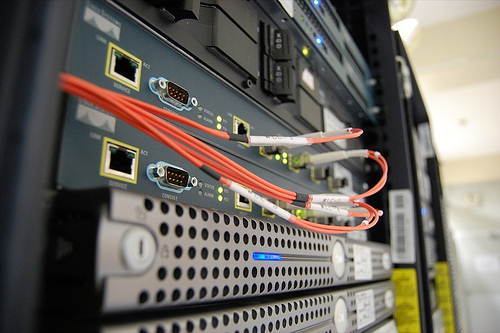

Installation d'un couple de serveurs dhcp et dns redondants
###########################################################
:date: 2009-09-30 00:15
:category: adminsys
:tags: bind, configuration, dhcp, jaunty, linux, redondant, ubuntu
:lang: fr

Cette fois ci, on s'oriente plus du côté des petites entreprises qui ont
rapidement besoin d'une gestion interne du réseau, simple, efficace et
sécurisée. Le but de cet article est donc de montrer pas à pas comment
monter deux serveurs dhcp+dns qui se backupent l'un l'autre de manière
transparente. Ces deux serveurs seront les piliers du réseau naissant de
la petite entreprise. 

Pour l'installation de base, il suffit de suivre
le `tuto d'installation d'un serveur ubuntu`_, en s'arrêtant juste avant
l'install de lighttpd qui n'est pas nécessaire ici (mais cela marche
aussi avec bien sûr). Le tuto a l'air assez long mais il est
relativement simple et rapide à mettre en oeuvre : en partant de deux
serveurs vides, non installés, suivre les deux tutos d'install générique
et celui ci de dhcp+dns, il suffit d'a peine 2H pour tout terminer et
avoir ses serveurs fonctionnels.

Introduction
------------

-  Nous allons utiliser, classiquement, les serveurs bind et dhcpd 3
-  L'installation s'effectue sur deux machines, que l'on nommera
   respectivement ns1 et ns2
-  Le domaine installé est volontairement local et sera appelé :
   monentreprise.local
-  Le réseau local sera la classe C : 192.168.1.0/24
-  et les machines ns1 et ns2 auront respectivement les ips :
   192.168.1.10 et 192.168.1.11
-  la passerelle internet sera 192.168.1.1

toutes ces valeurs sont des hypothèses et doivent être adaptées en
fonction de votre config. A la fin de l'installation, nous devrions
avoir deux serveurs, un 'maitre' dhcp et dns (ns1) et son 'esclave'
(ns2). Les baux dhcp délivrés par le maitre étant mis à jour
automatiquement dans le dns, le tout répliqué automatiquement sur
l'esclave. L'esclave prenant le relais automatiquement si le maître ne
marche plus.

Installation de base et commune aux deux serveurs
-------------------------------------------------

Comme son nom l'indique, il faut donc executer ces lignes de façon
identique sur chacun des deux serveurs.

Installation des paquets
~~~~~~~~~~~~~~~~~~~~~~~~

dhcp
^^^^

.. code-block:: bash

   sudo apt-get install dhcp3-server

on stoppe le serveur tant qu'il n'est pas configuré pour éviter de mettre la
grouille sur le réseau:

.. code-block:: bash

   sudo /etc/init.d/dhcp3-server stop

dns
^^^

.. code-block:: bash

   sudo apt-get install bind9

Préparation du firewall
~~~~~~~~~~~~~~~~~~~~~~~

Dans le firewall, il est nécessaire d'ouvrir explicitement quelques
ports pour :

-  le dns
-  la mise a jour dynamique des dns suite aux baux délivrés par le dhcp
-  la synchronisation des dhcps entre eux

Editer le fichier du firewall : 

.. code-block:: bash

   sudo vim /etc/init.d/server_iptables

et ajouter les lignes suivantes :

.. code-block:: bash

   # Autorise les requetes DNS
   iptables -A INPUT -s 192.168.1.0/24 -p tcp -i eth0 --dport 53 -j ACCEPT
   iptables -A INPUT -s 192.168.1.0/24 -p udp -i eth0 --dport 53 -j ACCEPT
   # Autorise les MAJ DDNS
   iptables -A INPUT -s 192.168.1.0/24 -p tcp -i eth0 --dport 953 -j ACCEPT
   # Autorise le failover dhcp
   iptables -A INPUT -s 192.168.1.0/24 -p tcp -i eth0 --dport 647 -j ACCEPT

On remarque ici qu'on
autorise ces ports uniquement depuis les adresses de notre réseau local.
On pourrait encore durir les règles en autorisant les maj ddns et les
synchros dhcp uniquement depuis nos deux serveurs. 

Relancer les règles
du Firewall: 

.. code-block:: bash

   sudo /etc/init.d/server_iptables

préparation du dns : configuration du logging en mode debug
~~~~~~~~~~~~~~~~~~~~~~~~~~~~~~~~~~~~~~~~~~~~~~~~~~~~~~~~~~~

.. code-block:: bash

   sudo vim /etc/bind/named.conf.debug.log

.. code-block:: bash

   logging {
     category "default" { "debug"; };
     category "general" { "debug"; };
     category "database" { "debug"; };
     category "security" { "debug"; };
     category "config" { "debug"; };
     category "resolver" { "warning"; };
     category "xfer-in" { "debug"; };
     category "xfer-out" { "debug"; };
     category "notify" { "debug"; };
     category "client" { "debug"; };
     category "unmatched" { "debug"; };
     category "network" { "debug"; };
     category "update" { "debug"; };
     category "queries" { "warning"; };
     category "dispatch" { "debug"; };
     category "dnssec" { "debug"; };
     category "lame-servers" { "debug"; };
  
     channel "debug" {
       file "/var/log/bind9/nameddbg" versions 2 size 50m;
       print-time yes;
       print-category yes;
       print-severity yes;
     };
  
     channel "warning" {
       file "/var/log/bind9/nameddbg" versions 2 size 50m;
       severity warning;
       print-time yes;
       print-category yes;
       print-severity yes;
     };
   };

Cette conf est très verbose, il sera peut-être nécessaire de la réduire
une fois l'installation achevée et fonctionnelle. Par défault, le
répertoire /var/log/bind9 n'existe pas et est bloqué par apparmor, il
faut donc le créer et l'autoriser: 

.. code-block:: bash

   sudo mkdir /var/log/bind9 
   sudo chown bind:bind /var/log/bind9

Configurer apparmor pour autoriser l'écriture dans le repertoire du log: 

.. code-block:: bash

   sudo vim /etc/apparmor.d/usr.sbin.named

et ajouter à la fin (dans la zone sur les logs): 

.. code-block:: bash

   /var/log/bind9/\*\* rw, 
   /var/log/bind9/ rw,

redémarrer apparmor
(on relancera bind à la fin de la config)

.. code-block:: bash

   sudo /etc/init.d/apparmor restart

sur le maître (ns1)
-------------------

travaux préparatoire : génération des clefs partagées
~~~~~~~~~~~~~~~~~~~~~~~~~~~~~~~~~~~~~~~~~~~~~~~~~~~~~

des clefs seront nécessaires pour la mise à jour du dns par le dhcp,
ainsi que pour la configuration rndc (rndc est un outil de configuration
pour bind, optionnel, mais bind aime bien qu'il soit là). On va donc
aussi configurer rndc sur le maitre.

rndc
^^^^

.. code-block:: bash

   cd /etc/bind 
   sudo dnssec-keygen -a hmac-md5 -b 256 -n HOST ns1

ce programme va générer deux fichier nommés
Kns1.xxxxxxxx.key et Kns1.xxxxxxxx.private le fichier .key va devenir
notre clef rndc: 

.. code-block:: bash

   sudo mv Kns1.xxxxxxxxx.key rndc.key

(remplacer les xxxxxxxx par le bon nom) ensuite afficher le
contenu du fichier private: 

.. code-block:: bash

   sudo cat Kns1.xxxxxxxxx.private

et copier le texte après 'Key:' ensuite
créer le fichier de conf rndc:

.. code-block:: bash

   sudo vim /etc/bind/rndc.conf

et coller les éléments suivants: 

.. code-block:: bash

   key rdnc-key {
     algorithm hmac-md5;
     secret "XXXXXXXXXXXXXXXXXXXXXXXXXXXXXXXXXXXXXXXXXXXXX";
   };
  
   options {
     // what host should rndc attempt to control by default
     default-server 127.0.0.1;
     // and what key should it use to communicate with named
     default-key "rdnc-key";
   };
  
   server 127.0.0.1 {
     // always use this key with this host
     key "rdnc-key";
   };

et remplacer les XXXXX du secret par ce qu'on
a copié après 'Key:' du fichier Kns1.xxxxxxxxx.private on peut
maintenant effacer le fichier .private: 

.. code-block:: bash

   sudo rm Kns1.xxxxxxxxx.private

clef pour mise à jour venant du dhcp
^^^^^^^^^^^^^^^^^^^^^^^^^^^^^^^^^^^^

.. code-block:: bash

   cd /etc/bind 
   sudo dnssec-keygen -a hmac-md5 -b 128 -n USER dhcpupdate

Dans le fichier .key genéré, copier la clef : La
clef est la dernière chaine de caractère du fichier .key, par exemple
ici: 

::

   dhcpupdate. IN KEY 0 3 157 Zihefb3NqqepA/5RgzbicM== 

la clef est: Zihefb3NqqepA/5RgzbicM== 

avec cette clef, on a généré des directives de
configuration pour le dhcp et pour le dns, elles auront l'aspect suivant: 

pour le dns: 

.. code-block:: bash

   key dhcpupdate {
     algorithm hmac-md5;
     secret "ICICOLLERLACLEFSECRETEGENEREE";
   };

pour le dhcp (pareil que pour le dns, mais sans les guillemets): 

.. code-block:: bash

   key dhcpupdate {
     algorithm hmac-md5;
     secret ICICOLLERLACLEFSECRETEGENEREE;
   };

dhcp
~~~~

.. code-block:: bash

   sudo vim /etc/dhcp3/dhcpd.conf

et mettre le fichier de conf suivant: 

.. code-block:: bash

   #
   # Sample dhcpd.conf file
   #
    
   # ======== Mise a jour DDNS ========
   ddns-domainname "monentreprise.local";
   ddns-rev-domainname "1.168.192.in-addr.arpa";
   #Mehode de mise a  jour du DNS
   ddns-update-style interim;
   #Mise a  jour autorisee
   ddns-updates on;
   #ici on force la maj par le dhcp et non par le client
   ignore client-updates;
   #on force la maj des ipfixes
   update-static-leases on;
   # Clef partagee dhcpd et bind9
   key dhcpupdate {
       algorithm hmac-md5;
       secret ICICOLLERLACLEFSECRETEGENEREE;
   };
     
   # ======== Option Generales du dhcp ========
    
   # Server name
   server-name "dhcp.monentreprise.local";
     
   # option definitions common to all supported networks...
   option domain-name "monentreprise.local";
   option domain-name-servers 192.168.1.10, 192.168.1.11;
     
   default-lease-time 3600;
   max-lease-time 7200;
     
   # If this DHCP server is the official DHCP server for the local
   # network, the authoritative directive should be uncommented.
   authoritative;
     
   # Use this to send dhcp log messages to a different log file (you also
   # have to hack syslog.conf to complete the redirection).
   log-facility local7;
     
   # No service will be given on this subnet, but declaring it helps the
   # DHCP server to understand the network topology.
   subnet 192.168.1.0 netmask 255.255.255.0 {
   }
     
   #Zones
   zone 1.168.192.in-addr.arpa. {
     primary 127.0.0.1;
     key dhcpupdate;
   }
     
   zone linkcareservices.local. {
     primary 127.0.0.1;
     key dhcpupdate;
   }
     
   # ======== Failover configuration ========
   failover peer "dhcp-failover" {
     primary; # declare this to be the primary server
     address 192.168.1.10;
     port 647;
     peer address 192.168.1.11;
     peer port 647;
     max-response-delay 30;
     max-unacked-updates 10;
     load balance max seconds 3;
     mclt 1800;
     split 128;
   }
     
   # ======== Reseaux ========
   ## déclaration sous réseau 192.168.1.*
   subnet 192.168.1.0 netmask 255.255.255.0 {
     # Si vous voulez spécifier un domaine différent de celui par défaut :
     #option domain-name "mon_domaine.qqc";
     ## Adresse de diffusion
     option broadcast-address 192.168.1.255;
     ## routeur par défaut
     option routers 192.168.1.1;
           ## Plage d'attribution d'adresse
           ## Ici on ouvre pour l'instant une 'petite' plage entre .50 et .99, c'est un exemple, on peut mettre plus.
     pool {
       failover peer "dhcp-failover";
       range 192.168.1.50 192.168.1.99;
     }
     # évalue si l'adresse est déjà attribuée
     ping-check = 1;
   }
     
   host ns1 {
     hardware ethernet 00:00:00:00:00:00;
     fixed-address 192.168.1.10;
   }
     
   host ns2 {
     hardware ethernet 00:00:00:00:00:00;
     fixed-address 192.168.1.11;
   }
  
Pour que le fichier de configuration soit complet, il faudra
remplacer les ICICOLLERLACLEFSECRETEGENEREE de la clef par la clef
générée précedemment. Il y a également deux baux statiques dans le
fichier de configuration pour nos serveurs ns1 et ns2, il faut remplacer
les 00:00... des adresses MAC par les vraies adresses mac de vos
machines.

dns
~~~

named.conf
^^^^^^^^^^

ce fichier représente la configuration principale du dns, on va juste
ajouter quelques directives en début de fichier: 

.. code-block:: bash

   sudo vim /etc/bind/named.conf

et ajouter en début de fichier les
éléments suivants: 

.. code-block:: bash

   acl internals { 127.0.0.0/8; 192.168.1.0/24; };
 
   controls {
     inet 127.0.0.1 allow { 127.0.0.1; localhost; } keys { "rdnc-key"; };
   };
 
   key rdnc-key {
     algorithm hmac-md5;
     secret "XXXXXXXXXXXXXXXXXXXXXXXXXXXXXXXXXXXXXXXXXXXXX";
   };
 
   key dhcpupdate {
     algorithm hmac-md5;
     secret "ICICOLLERLACLEFSECRETEGENEREE";
   };

en remplaçant XXXXXXXXXXXXXXXXXXXXXXXXXXXXXXXXXXXXXXXXXXXXX
par la clef rndc générée précedemment, et en remplaçant
ICICOLLERLACLEFSECRETEGENEREE par la clef dhcpupdate générée plus haut.

named.conf.options
^^^^^^^^^^^^^^^^^^

.. code-block:: bash

   sudo vim /etc/bind/named.conf.options

Comme on est en train de construire des serveurs pour un petit réseau interne,
nous n'avons pas besoin que les dns résolvent tout internet, on va donc
les configurer pour faire relais vers d'autre dns. L'avantage, c'est
qu'on peut choisir ceux qu'on veut, et pas obligatoirement ceux de son
ISP, même si au final il est quand même préférable d'en choisir des pas
trop loin et si possible performants. Les DNS des ISP répondent souvent
à ces problématiques. Vous pouvez aussi mettre simplement le dns de
votre routeur/box en relais, nos dns internes servant au final à gérer
les zones internes. Le fichier complet ressemble donc à ceci: 

.. code-block:: bash

   options {
           directory "/var/lib/bind";
    
           // If there is a firewall between you and nameservers you want
           // to talk to, you may need to fix the firewall to allow multiple
           // ports to talk.  See http://www.kb.cert.org/vuls/id/800113
    
           // If your ISP provided one or more IP addresses for stable
           // nameservers, you probably want to use them as forwarders. 
           // Uncomment the following block, and insert the addresses replacing
           // the all-0's placeholder.
    
           // forwarders {
           //      0.0.0.0;
           // };
     forwarders {
       aa.bb.cc.dd;
       ee.ff.gg.hh;
       192.168.1.1;
     };
    
           auth-nxdomain no;    # conform to RFC1035
           listen-on-v6 { none; };
     listen-on { 127.0.0.1; 192.168.1.10; 192.168.1.11; };
      
     // transférer les informations de zones aux DNS secondaires
     allow-transfer { 192.168.1.11; };
         
     // Accepter les requêtes pour le réseau interne uniquement
     allow-query { internals; };
              
     // Autoriser les requêtes récursives pour les hôtes locaux
     allow-recursion { internals; };
                   
     // Ne pas rendre publique la version de BIND
     version none;
    
   };
   

dans la zone 'forwarders', vous pouvez donc remplacer les ips aa.bb.cc.dd et
ee.ff.gg.hh par deux dns publics ou ceux de votre isp, ou vous pouvez
enlever les lignes pour ne garder que le dns du routeur. Dans cette
config, on autorise le transfert des infos de DNS vers notre futur
secondaire. Il y a un autre élément important dans ce fichier de config: 
le répertoire par défaut de travail de bind qui doit être
/var/lib/bind: sous ubuntu 9.04, par défaut, seul ce répertoire
autorise bind à écrire dans le fichier et c'est nécessaire pour la maj
ddns venant du dhcp.

named.conf.local
^^^^^^^^^^^^^^^^

.. code-block:: bash

   sudo vim /etc/bind/named.conf.local

insérer les zones et les reverses: 

.. code-block:: bash

   ///
   // Do any local configuration here
   //
     
   // Consider adding the 1918 zones here, if they are not used in your
   // organization
   //include "/etc/bind/zones.rfc1918";
     
   include "/etc/bind/named.conf.debug.log";
     
   zone "monentreprise.local" {
       type master;
       notify yes;
       allow-transfer { 192.168.1.11; } ;
       file "monentreprise.local.hosts";
   };
     
   zone "1.168.192.in-addr.arpa" {
       type master;
       notify yes;
       allow-transfer { 192.168.1.11; } ;
       file "1.168.192.in-addr.arpa.zone";
   };
   
Cette config indique que ce dns est 'master' pour les deux zones et qu'il
notifie et transfère les infos de zones vers le secondaire. De plus, il
pointe sur une configuration de debug particulière qui est utile pour
l'analyse des problème de la configuration et que l'on a paramétré
précédemment.

les fichiers de zones
^^^^^^^^^^^^^^^^^^^^^

Il faut maintenant créer les fichier de la zone et du reverse. On va les
créer dans /etc/bind, puis les lier dans /var/lib/bind/ où va vraiment
aller les chercher bind, suite à notre config dans options.

.. code-block:: bash

   sudo vim /etc/bind/monentreprise.local.hosts

et mettre les infos suivantes (c'est un exemple, mais qui est paramétré
avec deux serveurs DNS pour préparer la conf/maitre-esclave)

.. code-block:: bash

   @      IN     SOA     ns1.monentreprise.local. email.monentreprise.com. (
               20092909003 ; serial
               600 ; refresh after 10 minutes (for testing purpose)
               3600 ; retry after 1 hour
               604800 ; expires after 1 week
               86400 ) ; minimum TTL of 1 day
   @     IN     NS     ns1.monentreprise.local.
   @     IN     NS     ns2.monentreprise.local.
   gw          IN  A       192.168.1.1
   ns1         IN  A       192.168.1.10
   ns2         IN  A       192.168.1.11
   dhcp        IN  CNAME   ns1
   dhcp2         IN  CNAME   ns2

Dans la premiere ligne, il faut indiquer un email après le serveur (ne pas
oublier les '.' à la fin). bizarrement, l'email est de la forme
email.domaine.suffixe. alors que cela veut dire email@domaine.suffixe
faire de même avec le reverse: 

.. code-block:: bash

   sudo vim /etc/bind/1.168.192.in-addr.arpa.zone 

.. code-block:: bash

   @       IN    SOA     ns1.monentreprise.local. email.monentreprise.com. (
               20090929002 ; serial
               600 ; refresh after 10 minutes (for testing purpose)
               3600 ; retry after 1 hour
               604800 ; expires after 1 week
               86400 ) ; minimum TTL of 1 day
   @       IN     NS     ns1.monentreprise.local.
   @       IN     NS     ns2.monentreprise.local.
   1       IN     PTR    gw.monentreprise.local.
   10     IN     PTR    ns1.monentreprise.local.
   11     IN     PTR    ns2.monentreprise.local.

Pour ces deux fichiers, si vous les
modifiez à la main, il est important de faire évoluer le sérial à chaque
modification. Sinon le DNS principal n'ira pas notifier le secondaire.
maintenant on va faire en sorte que ces fichiers soient dispos dans
/var/lib/bind et modifiables par bind: 

.. code-block:: bash

   sudo chown bind:bind /etc/bind/monentreprise.local.hosts 
   sudo chown bind:bind /etc/bind/1.168.192.in-addr.arpa.zone 
   sudo ln -s /etc/bind/monentreprise.local.hosts /var/lib/bind/monentreprise.local.hosts 
   sudo ln -s /etc/bind/1.168.192.in-addr.arpa.zone /var/lib/bind/1.168.192.in-addr.arpa.zone

redémarrage
~~~~~~~~~~~

on peut enfin redémarrer bind et démarrer le dhcp 

.. code-block:: bash

   sudo /etc/init.d/bind9 restart 
   sudo /etc/init.d/dhcp3-server start

.. warning:: **Attention :** il ne faut pas oublier de désactiver le ou les
   précédents serveurs dhcp sur le réseau (celui du routeur/de la box par
   exemple).

sur l'esclave (ns2)
-------------------

La conf sur l'esclave est plus simple car il n'y a pas de système de maj
ddns et les fichiers de zones dns sur récupérées automatiquement du
maitre.

dhcp
~~~~

.. code-block:: bash

   sudo vim /etc/dhcp3/dhcpd.conf

et mettre la conf suivante: 

.. code-block:: bash

   #
   # Sample dhcpd.conf file
   #
    
   # ======== Mise a jour DDNS ======== 
   ddns-update-style none;
    
   # ======== Option Generales du dhcp ========
   # Server name
   server-name "dhcp2.monentreprise.local";
     
   # option definitions common to all supported networks...
   option domain-name "monentreprise.local";
   option domain-name-servers 192.168.1.10, 192.168.1.11;
     
   default-lease-time 3600;
   max-lease-time 7200;
     
   # If this DHCP server is the official DHCP server for the local
   # network, the authoritative directive should be uncommented.
   authoritative;
     
   # Use this to send dhcp log messages to a different log file (you also
   # have to hack syslog.conf to complete the redirection).
   log-facility local7;
     
   # No service will be given on this subnet, but declaring it helps the
   # DHCP server to understand the network topology.
   subnet 192.168.1.0 netmask 255.255.255.0 {
   }
     
   # ======== Failover configuration ========
   failover peer "dhcp-failover" {
     secondary; # declare this to be the secondary server
     address 192.168.1.11;
     port 647;
     peer address 192.168.1.10;
     peer port 647;
     max-response-delay 30;
     max-unacked-updates 10;
     load balance max seconds 3;
   }
     
   # ======== Reseaux ========
   ## déclaration sous réseau 192.168.1.*
   subnet 192.168.1.0 netmask 255.255.255.0 {
     # Si vous voulez spécifier un domaine différent de celui par défaut :
     #option domain-name "mon_domaine.qqc";
     ## Adresse de diffusion
     option broadcast-address 192.168.1.255;
     ## routeur par défaut
     option routers 192.168.1.1;
           ## Plage d'attribution d'adresse
           # Ici on ouvre pour l'instant une 'petite' plage entre .50 et .99, c'est un exemple, on peut mettre plus.
     pool {
       failover peer "dhcp-failover";
       range 192.168.1.50 192.168.1.99;
     }
     # évalue si l'adresse est déjà attribuée
     ping-check = 1;
   }
     
   host ns1 {
     hardware ethernet 00:00:00:00:00:00;
     fixed-address 192.168.1.10;
   }
     
   host ns2 {
     hardware ethernet 00:00:00:00:00:00;
     fixed-address 192.168.1.11;
   }

Comme pour le dhcp maître, il y a deux baux statiques dans le
fichier de configuration pour nos serveurs ns1 et ns2, il faut remplacer
les 00:00… des adresses MAC par les vraies adresses mac de vos machines.

dns
~~~

named.conf
^^^^^^^^^^

.. code-block:: bash

   sudo vim /etc/bind/named.conf

ajouter juste, en début de fichier, l'acl internals: 

.. code-block:: bash

   acl internals { 127.0.0.0/8; 192.168.1.0/24; };

named.conf.options
^^^^^^^^^^^^^^^^^^

.. code-block:: bash

   sudo vim /etc/bind/named.conf.options

Ce fichier est très proche de celui du maitre, sauf qu'il n'a plus la
directive 'allow-transfer': 

.. code-block:: bash

   options {
           directory "/var/lib/bind";
    
           // If there is a firewall between you and nameservers you want
           // to talk to, you may need to fix the firewall to allow multiple
           // ports to talk.  See http://www.kb.cert.org/vuls/id/800113
    
           // If your ISP provided one or more IP addresses for stable
           // nameservers, you probably want to use them as forwarders.
           // Uncomment the following block, and insert the addresses replacing
           // the all-0's placeholder.
    
           // forwarders {
           //      0.0.0.0;
           // };
     forwarders {
       aa.bb.cc.dd;
       ee.ff.gg.hh;
       192.168.1.1;
     };
    
           auth-nxdomain no;    # conform to RFC1035
           listen-on-v6 { none; };
     listen-on { 127.0.0.1; 192.168.1.10; 192.168.1.11; };
    
     // transférer les informations de zones aux DNS secondaires
     allow-transfer { 192.168.1.11; };
    
     // Accepter les requêtes pour le réseau interne uniquement
     allow-query { internals; };
    
     // Autoriser les requêtes récursives pour les hôtes locaux
     allow-recursion { internals; };
    
     // Ne pas rendre publique la version de BIND
     version none;
    
   };

named.conf.local
^^^^^^^^^^^^^^^^

.. code-block:: bash

   sudo vim /etc/bind/named.conf.local

Ici la conf est sensiblement différente, car on précise que les zones sont
'esclaves': 

.. code-block:: bash

   //
   // Do any local configuration here
   //
     
   // Consider adding the 1918 zones here, if they are not used in your
   // organization
   //include "/etc/bind/zones.rfc1918";
     
   include "/etc/bind/named.conf.debug.log";
     
   zone "linkcareservices.local" {
       type slave;
       masters {192.168.1.10;} ;
       file "linkcareservices.local.hosts";
   };
     
   zone "1.168.192.in-addr.arpa" {
       type slave;
       masters {192.168.1.10;} ;
       file "1.168.192.in-addr.arpa.zone";
   };

Il n'y a pas besoin de
créer à la main les fichiers de zones : ils seront transférés
automatiquement depuis le maitre.

redémarrage
~~~~~~~~~~~

on peut enfin redémarrer bind et démarrer le dhcp 

.. code-block:: bash

   sudo /etc/init.d/bind9 restart 
   sudo /etc/init.d/dhcp3-server start

Debugging
---------

Ce tuto est censé marcher directement, mais vous rencontrez des
problèmes, voici quelques infos / trucs pour débugger les problèmes.
J'essaierais de faire évoluer cette zone au fur et à mesure.

analyser les logs
~~~~~~~~~~~~~~~~~

les logs du dhcp sont dans /var/log/syslog les logs du dns sont dans
/var/log/bind9/nameddbg Avant tout, il faut bien regarder ces logs à la
recherce de problèmes

j'ai beau changer mes conf dns, mon problème persiste
~~~~~~~~~~~~~~~~~~~~~~~~~~~~~~~~~~~~~~~~~~~~~~~~~~~~~

Je me suis cassé la tête des heures durant sur des problèmes de MAJ ddns
du dhcp vers le dns qui ne marchaient pas. Au final, le pb était qu'il y
avait deux dns qui tournaient sur la machine. Ce pb a l'air plus courant
qu'il n'y parait : ça m'est déjà arrivé deux fois (et deux fois je suis
tombé dans le panneau). C'est peut-être un pb dans le restart du serveur
dans init.d qui ne marche pas bien. Donc si vous avez un doute: 

.. code-block:: bash

   sudo /etc/init.d/bind9 stop

puis: 

.. code-block:: bash

   ps -ef | grep named

et si le ps montre un process named qui tourne encore, alors ne pas hésiter à le killer sauvagement:

.. code-block:: bash

   sudo kill -9 XXXXXX

XXXXXX étant le numéro du process. puis:

.. code-block:: bash

   sudo /etc/init.d/bind9 start

.. _tuto d'installation d'un serveur ubuntu: http://chiroux.org/installation-dun-serveur-web-securise-sous-ubuntu-9-04server/

